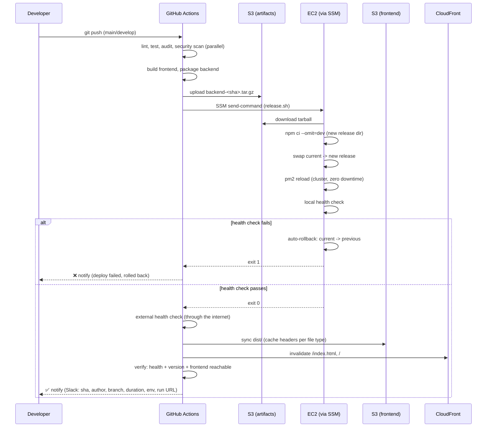

# AlgoForge CI/CD & Deployment

This document describes the production CI/CD pipeline: how it's built, why it's
built that way, what you still need to configure, and how to explain it.

---

## 1. The pipeline (what's already built)

Two workflows live in `.github/workflows/`:

- **`ci-cd.yml`** — the main pipeline. Triggers on push to `main` (→ production)
  or `develop` (→ staging), and on pull requests into either (CI only, no deploy).
- **`rollback.yml`** — manual, `workflow_dispatch`-only. For the case where a
  deploy passed its health check but a bug surfaced later.

Job graph in `ci-cd.yml`:

```
security-scan ─┐
ci-backend ─────┼─→ package-backend ─→ deploy-backend ─→ deploy-frontend ─→ verify ─→ notify
ci-frontend ────┘                           │                    │             │
                                     (auto-rollback              (S3 sync +   (external
                                      inside release.sh           CloudFront   health +
                                      on failed health)           invalidate)  version check)
```

Nothing deploys unless `ci-backend`, `ci-frontend`, and `security-scan` all
pass — deployment jobs list them in `needs:`, and GitHub Actions won't start a
job until everything in its `needs:` list has succeeded.

---

## 2. Deployment architecture

```
GitHub push (main / develop)
        │
        ▼
GitHub Actions (OIDC → AWS, no stored keys)
        │
        ├─→ builds frontend once ──────────────┐
        │                                       │
        └─→ packages backend once ──→ S3 (artifacts bucket)
                                                 │
                                                 ▼
                                    EC2 (via SSM, no SSH)
                                    ├─ downloads tarball
                                    ├─ npm ci --omit=dev (in a new release dir)
                                    ├─ atomic symlink swap: current -> new release
                                    ├─ pm2 reload (cluster, zero-downtime)
                                    └─ local health check → auto-rollback if it fails
                                                 │
                                                 ▼ (only after backend is healthy)
                                    S3 (frontend bucket) + CloudFront invalidation
```

Frontend: **S3 + CloudFront** (unchanged from before this pipeline).
Backend: **EC2 + PM2 + nginx**, now deployed via **versioned releases** instead
of an in-place `git pull` (see §4).

---

## 3. Folder structure

**Repo** (new/changed paths from this work):

```
.github/workflows/
  ci-cd.yml            # main pipeline
  rollback.yml          # manual rollback

backend/
  routes/publicHealth.js  # GET /health — unauthenticated, used by the pipeline
  ecosystem.config.js      # PM2 cluster config (2 instances, zero-downtime reload)
  eslint.config.js
  audit-ci.jsonc           # security-audit allowlist (see §6)
  tests/health.test.js
  scripts/deploy/
    release.sh             # atomic versioned deploy + auto-rollback
    rollback.sh            # manual/automatic rollback
    health-check.sh         # shared curl-with-retries helper

frontend/
  eslint.config.js
  vitest.config.ts
  audit-ci.jsonc
  src/test/setup.ts
  src/components/ui/DiffBadge.test.tsx

infra/
  iam/    # the actual IAM policy JSON (source of truth, not just chat output)
  setup/  # idempotent scripts that apply those policies to AWS

docs/DEPLOYMENT.md   # this file
```

**On the EC2 box** (`/home/ec2-user/backend/`):

```
releases/
  a1b2c3.../          # one full checkout + its own node_modules
  d4e5f6.../
  <newest>/
current -> releases/<newest>     # symlink — this is what PM2 actually runs
previous -> releases/<prior>     # symlink — one-step rollback target
shared/
  .env                # persists across every release, never in the artifact
  ecosystem.config.js  # copied here once; release.sh keeps it in sync
  scripts/             # deploy tooling, refreshed from each new artifact
  logs/
```

---

## 4. Rollback mechanism

Two layers:

**Automatic** (inside `release.sh`, every deploy): before swapping `current`
to the new release, it records what `current` currently points at. After the
symlink swap and `pm2 reload`, it runs the health check locally. If that
fails, it immediately repoints `current` back and reloads again — so a bad
deploy is live for, at most, a few seconds before self-healing. No human
needs to be watching.

**Manual** (`rollback.yml`, triggered anytime): for the case where the health
check passed (app started fine) but a real bug shipped anyway. Points
`current` at `previous` and reloads — same one-command mechanism, just
triggered by a person instead of a failed check.

Why symlinks instead of `git reset --hard` or reinstalling an old version:
a symlink swap is a single filesystem operation — effectively atomic, and
instant. There's no window where half the old code and half the new code
coexist on disk, and rollback doesn't need network access or `npm install` to
run again (the old release's `node_modules` is already sitting right there).

Frontend rollback works differently since S3 objects are just overwritten:
every successful `deploy-frontend` run also saves a full copy of that build
to `s3://algoforge-deploy-artifacts-.../frontend/<sha>/`. Rolling the frontend
back means `aws s3 sync` from a prior SHA's saved copy back onto the live
bucket, then a CloudFront invalidation. Not automated in this v1 — worth
adding to `rollback.yml` as a future step if a frontend-only bug ever needs it.

---

## 5. Security

- **No long-lived AWS credentials anywhere.** GitHub's OIDC token is
  exchanged for temporary credentials scoped to `AlgoForgeGitHubActionsRole`,
  which itself only trusts `repo:varuntutejaa/Algoforge` on `main`/`develop`
  (see `infra/iam/github-actions-trust-policy.json`).
- **Least privilege**: the role can touch exactly the S3 buckets, CloudFront
  distributions, and EC2 instance it needs — nothing else in the AWS account,
  even other resources under the same account (`infra/iam/github-actions-permissions-policy.json`).
- **SSM instead of SSH**: no inbound port 22 needed for deploys, no SSH key
  to leak. The EC2 instance authenticates outbound to AWS via its own IAM
  instance profile.
- **Secret scanning**: `gitleaks` scans every push/PR for committed secrets.
- **Dependency scanning**: `npm audit` via `audit-ci`, gated at high/critical,
  scoped to production dependencies only (`skip-dev`). Backend currently has
  a clean bill of health (removing `firebase-admin` eliminated every
  previously-tracked issue); frontend's `audit-ci.jsonc` still allowlists two
  small, dated, build-tool-only advisories (Vite dev server, PostCSS
  sourcemaps) — see the comments in that file for exactly why. Anything new
  fails the build.
- **Trivy filesystem scan** as a second, independent scanner (different
  vulnerability database/heuristics than `npm audit`) — same high/critical gate.
- **Secrets live in `shared/.env` on the box, never in the deploy artifact.**
  The tarball GitHub Actions builds and uploads to S3 contains zero secrets;
  `release.sh` symlinks the persistent `.env` into each new release directory.

---

## 6. Cost implications

| Item | Cost |
|---|---|
| GitHub Actions minutes | Free tier covers this easily for a personal project (2,000 min/month on free plan) |
| S3 artifacts bucket | Cents/month — tiny tarballs, 90-day expiry lifecycle rule already configured |
| Existing prod S3 + CloudFront + EC2 | Unchanged — this pipeline doesn't add new production infrastructure |
| **Staging environment (if provisioned)** | **New cost**: one more `t3.micro` EC2 (~$7-8/month in ap-south-1), a second S3 bucket (cents), a second CloudFront distribution (pay-per-request, negligible at low traffic) |
| Trivy / Gitleaks / audit-ci | Free, open-source, run inside your existing Actions minutes |

The only real new recurring cost is the staging EC2 instance, and only if
you provision it (see `infra/setup/create-staging-environment.sh` — it
requires an explicit `--yes` flag specifically so it's never run by accident).

---

## 7. Why each improvement matters

- **Lint/test/audit before build/deploy**: catches a broken build or an
  obviously buggy change before it ever reaches a server, instead of
  discovering it live.
- **Build once, deploy the same artifact**: eliminates "works on my machine
  but not on the server" — the exact bytes that passed CI are the exact bytes
  that run in production. Rebuilding on the target risks a different
  dependency resolution, a different Node patch version, or a flaky network
  blip mid-deploy.
- **Health-gated, auto-rolling-back deploys**: turns "deploy and hope" into
  "deploy and verify" — a bad release self-heals in seconds instead of
  serving errors until someone notices and manually intervenes.
- **Versioned releases + symlink swap**: makes rollback a non-event (one
  filesystem operation) instead of a stressful `git reset`/reinstall under
  pressure.
- **Backend-before-frontend ordering**: means any brief version-skew window
  is "new backend, still-cached old frontend" rather than the reverse — the
  safer direction, since it's on you to keep the backend backward-compatible
  for one release, rather than hoping old backend code can serve a brand-new
  frontend's requests.
- **OIDC instead of static AWS keys**: nothing to rotate, nothing to leak in
  a secrets-manager breach, nothing that still works if someone copies your
  repo's secrets six months from now.
- **GitHub Environments + required reviewers on production**: makes "who
  approved this prod deploy" an explicit, auditable click, not an implicit
  "well, someone pushed to main."
- **Cache-Control done properly**: hashed asset filenames + `immutable`
  cache headers means returning visitors re-download *nothing* unless a file
  actually changed; `index.html` with `no-cache` means they always get the
  latest pointer to those assets. Full-bucket CloudFront invalidations
  (`/*`) are unnecessary and slightly costly at scale — invalidating just
  `/index.html` and `/` is enough.

---

## 8. Deployment flow diagram



---

## 9. Interview explanation

*"How would you explain this pipeline in an interview?"*

> We run a build-once, deploy-verified pipeline on GitHub Actions targeting a
> single EC2 box behind CloudFront, without any long-lived AWS credentials.
> On push, CI runs lint/test/dependency-audit/secret-scan in parallel for
> both frontend and backend; nothing downstream starts unless all of that is
> green. We then build the frontend and package the backend exactly once,
> upload both to S3, and deploy the backend first via SSM — no SSH, the
> instance's own IAM role does the pulling. The deploy itself uses a
> versioned-release-plus-symlink pattern: each deploy gets its own directory
> with its own `node_modules`, and going live is a single atomic symlink
> swap, so rollback is just repointing that symlink back — no rebuild, no
> `git reset`. PM2 runs in cluster mode so the reload is zero-downtime. After
> the swap, the box runs its own health check; if it fails, it rolls itself
> back automatically before GitHub Actions even reports failure. Only once
> the backend is confirmed healthy — checked both locally on the box and
> externally over the internet — does the frontend deploy, which prevents a
> new frontend from ever talking to a backend that isn't ready yet. Static
> assets get long-lived immutable cache headers since they're content-hashed
> by Vite; only `index.html` needs a CloudFront invalidation on each deploy.
> Everything is environment-scoped through GitHub Environments, so the same
> workflow serves both a staging and a production target purely through
> configuration, and production requires a manual approval gate. The whole
> thing ends in a Slack notification either way, so a failure is never
> silent."

That's the one-paragraph version. If asked to go deeper, the follow-ups this
document answers are: *why symlinks over git* (§4), *why backend-first*
(§7), *how secrets never touch the artifact* (§5), and *what it costs* (§6).

---

## 10. What's still on you (not automatable from here)

This pipeline was built inside your existing account using a deliberately
narrow IAM user (`algoforge-deploy`) that cannot create IAM roles, policies,
or S3 buckets by design — creating/modifying IAM is something only you
should do, with your own admin credentials. Concretely:

1. **Apply the IAM updates**: `bash infra/setup/apply-iam-updates.sh`
   (idempotent — creates what's missing, updates the rest).
2. **Create the artifacts bucket**: `bash infra/setup/create-artifacts-bucket.sh`.
3. **Create the `develop` branch**: `git checkout -b develop && git push -u origin develop`.
4. **Set up GitHub Environments** (Settings → Environments):
   - `production`: add a required reviewer, then set these **variables**:
     `S3_BUCKET=algoforge-frontend-472888338171`,
     `CLOUDFRONT_DISTRIBUTION_ID=E1UVHN2W0SQ452`,
     `CLOUDFRONT_DOMAIN=djpb60zs17m9t.cloudfront.net`,
     `EC2_INSTANCE_ID=i-05242cb415eb164de`,
     `BACKEND_PUBLIC_URL=<your API's public HTTPS URL>`.
   - `staging`: run `infra/setup/create-staging-environment.sh --yes` first
     (creates new billable resources — read it before running), fill the
     `<STAGING_...>` placeholders into
     `infra/iam/github-actions-permissions-policy.json`, re-run
     `apply-iam-updates.sh`, then set the equivalent variables for staging.
5. **Slack webhook** (optional): create an [Incoming Webhook](https://api.slack.com/messaging/webhooks)
   in your workspace, add it as the repo secret `SLACK_WEBHOOK_URL`, and set
   the repo (or per-environment) variable `SLACK_WEBHOOK_CONFIGURED=true`.
   Swapping to Discord later just means changing the `curl` target and
   payload shape in the `notify` job — Discord's webhook format is similar
   (a JSON POST with a `content` field instead of Slack's `blocks`).
6. **Decommission the MongoDB Atlas cluster** — the app has fully migrated to
   RDS PostgreSQL (all Mongoose code and the `mongoose` dependency were
   removed from the repo) and Atlas is no longer needed at all, including as
   a rollback. This requires the Atlas web console (no Atlas CLI/API access
   was configured in this environment) — pause or terminate the cluster
   there. This also resolves the previously-flagged "rotate the exposed
   Mongo password" item from the earlier security review, since the
   credential stops mattering once the cluster is gone.
7. **On the EC2 box itself**, one-time bootstrap before the first pipeline
   deploy can succeed:
   ```bash
   mkdir -p /home/ec2-user/backend/shared/logs
   # Create /home/ec2-user/backend/shared/.env with your real DATABASE_URL
   # (RDS endpoint on port 5432, same ?sslmode=require&uselibpqcompat=true
   # suffix used locally — `pg` doesn't recognize RDS's CA chain by default,
   # regardless of network path), COGNITO_USER_POOL_ID, COGNITO_CLIENT_ID,
   # JUDGE0_*, GROQ_API_KEY, ADMIN_API_KEY, CORS_ORIGINS, PORT.
   ```
   Everything else (`releases/`, `current`, `previous`, `ecosystem.config.js`,
   the deploy scripts themselves) is created/refreshed automatically by
   `release.sh` on the first deploy.
